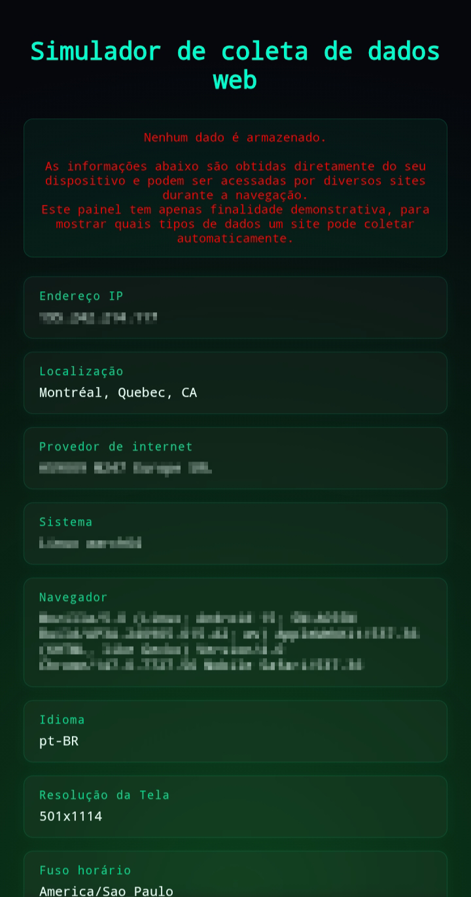
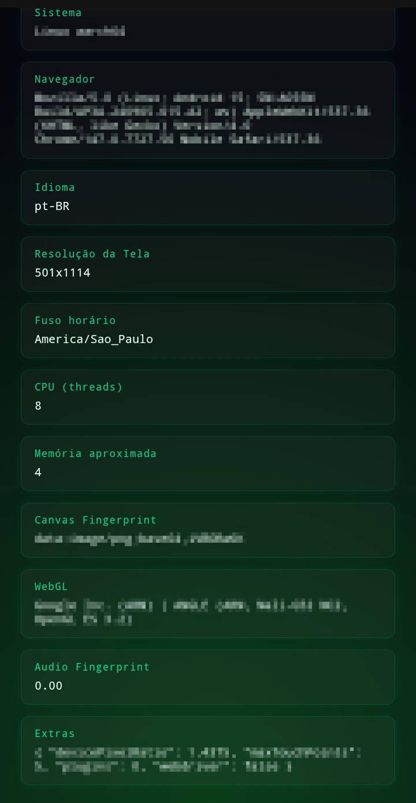

<h1 align="center">🧠 Demonstração de Fingerprinting e Privacidade na Web</h1>

  
  
  
  
  

---

🚀 Sobre

Um projeto interativo que mostra, na prática, quais informações um site consegue acessar automaticamente ao ser aberto.

Os dados são exibidos em um dashboard com estética hacker, com foco em educação e conscientização sobre privacidade digital.

---

📷 Preview
      
      📊 Dashboard

  

  

---

🛠️ Tecnologias

- HTML5
- CSS3
- JavaScript
- API pública (ipinfo)

---

⚠️ Privacidade

Nenhum dado é armazenado.
As informações são exibidas apenas para demonstração em tempo real.

---

▶️ Como usar

# abra no navegador
index.html

---

💡 Aprendizados

- Consumo de APIs
- Técnicas de fingerprinting
- Manipulação do DOM
- Responsividade
- Criação de interfaces interativas

---

📄 Observação

Projeto em desenvolvimento 🚧
